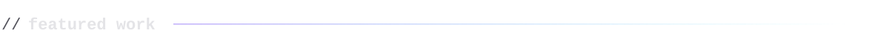

  
  
  

  <b>Roy Carmelli · רועי כרמלי</b> - Computer Science &amp; Neuroscience student at Bar-Ilan University, building AI tools and web apps. 
  Portfolio, CV and projects: <a href="https://roy-carmelli-portfolio.vercel.app/">roy-carmelli-portfolio.vercel.app</a>

  
  

  
  

  
  

  

building in public · Ramat Gan, Israel

