<a href="https://roy-carmelli-portfolio.vercel.app/"></a>

<p align="center">
  <a href="https://roy-carmelli-portfolio.vercel.app/"></a>
  <a href="https://linkedin.com/in/roy-carmelli"></a>
  <a href="mailto:roy.y.carmelli@gmail.com"></a>
</p>

```ts
const roy = {
  studies:  "B.Sc. Computer Science + Neuroscience @ Bar-Ilan University",
  focus:    ["AI agents", "LLM tooling", "MCP", "Python backends"],
  daily:    ["Claude Code", "MCP servers", "multi-provider LLM APIs"],
  curious:  "where software meets the brain",
  lookingFor: "student role · AI / LLM / backend engineering",
};
```


### `// featured`

<table>
  <tr>
    <td width="50%" valign="top">
      <h4><a href="https://github.com/Royc4515/Aside">Aside</a></h4>
      Browser extension: ask any of six LLM providers about the page you're reading, in a sidebar.<br/><br/>
      <code>JavaScript</code> <code>LLM APIs</code> <code>Chrome</code>
    </td>
    <td width="50%" valign="top">
      <h4><a href="https://github.com/Royc4515/AgentCheck">AgentCheck</a></h4>
      CLI that audits a Python AI agent for quality, token cost and security, grades it A-F and suggests cheaper alternatives.<br/><br/>
      <code>Python</code> <code>pydantic</code> <code>LLM-as-judge</code>
    </td>
  </tr>
  <tr>
    <td width="50%" valign="top">
      <h4><a href="https://github.com/Royc4515/gemini-sommelier-bot">Gemini Sommelier</a></h4>
      Serverless Telegram agent: live Google Sheets inventory, food-pairing logic and resilient LLM fallback chains.<br/><br/>
      <code>Python</code> <code>Gemini</code> <code>Serverless</code>
    </td>
    <td width="50%" valign="top">
      <h4><a href="https://github.com/Royc4515/Project3_SignalProcessing">Spike-Theta Phase Locking</a></h4>
      FIR/IIR filtering, Hilbert-transform phase and spike-theta locking on LFP and single-neuron data.<br/><br/>
      <code>Python</code> <code>NumPy</code> <code>SciPy</code>
    </td>
  </tr>
  <tr>
    <td width="50%" valign="top">
      <h4><a href="https://github.com/Royc4515/build-your-goat">Build Your GOAT</a></h4>
      TikTok-style NBA GOAT-builder web game, zero dependencies.<br/><br/>
      <code>TypeScript</code> <code>vanilla JS</code>
    </td>
    <td width="50%" valign="top">
      <h4><a href="https://github.com/Royc4515/background-cognitive-correlation">Cognitive Outcomes Analysis</a></h4>
      Socio-educational predictors of children's cognitive outcomes with OLS regression.<br/><br/>
      <code>Python</code> <code>Pandas</code> <code>SciPy</code>
    </td>
  </tr>
</table>

### `// stack`

<p>
  
</p>


<p align="center"><sub>building in public · Ramat Gan, Israel</sub></p>
